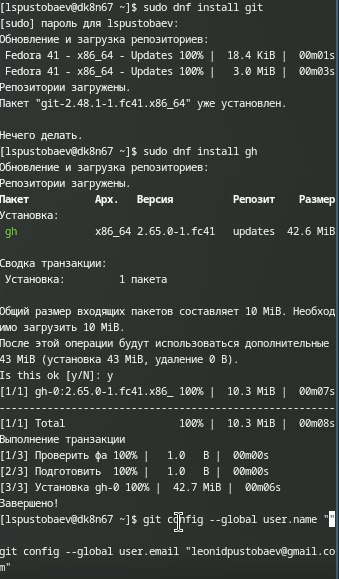
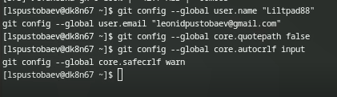
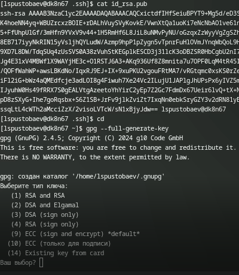
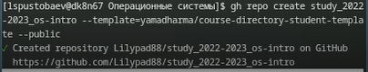

# Лабораторная работа №2. Git и контроль версий

## Титульный лист
**Министерство науки и высшего образования Российской Федерации**  
**Федеральное государственное автономное образовательное учреждение высшего образования**  
**Российский университет дружбы народов имени Патриса Лумумбы**  

**Кафедра:** Операционные системы  
**Дисциплина:** Операционные системы  

**Лабораторная работа №2**  
**Git и контроль версий**  

**Выполнил:**  
Студент группы НММбд-03-2024  
Пустобаев Л.С.  

**Преподаватель:**  
Кулябов Д.С.  

**Москва**  
2025 год  

---

## Введение
Целью данной работы является изучение идеологии и применения средств контроля версий, а также освоение навыков работы с системой Git. В ходе выполнения работы были выполнены следующие задачи:
- Установка и настройка Git.
- Создание SSH и PGP ключей.
- Настройка подписей коммитов.
- Регистрация на GitHub и создание репозитория.

---

## Основная часть
### Установка и настройка Git
1. Установка Git:
   ```bash
   sudo dnf install git```



2. Базовая настройка:
	```git config --global user.name "Иванов И.И."
git config --global user.email "ivanov@example.com"```



3. Создание SSH и PGP ключей:
	```ssh-keygen -t rsa -b 4096
gpg --full-generate-key```



4. Настройка GitHub:

    Добавление SSH-ключа на GitHub.

    Добавление PGP-ключа на GitHub.


5. Создание репозитория:
	```gh repo create study_2022-2023_os-intro --template=yamadharma/course-directory-student-template --public```



Заключение

В ходе выполнения лабораторной работы были освоены основные навыки работы с системой контроля версий Git. Были созданы SSH и PGP ключи, настроены подписи коммитов, а также создан репозиторий на GitHub. Полученные знания будут полезны для дальнейшей работы в рамках курса "Операционные системы".

Список использованных источников

    Официальная документация Git: https://git-scm.com/doc

    Официальная документация GitHub: https://docs.github.com

    ГОСТ 7.32-2001. Отчет о научно-исследовательской работе.
